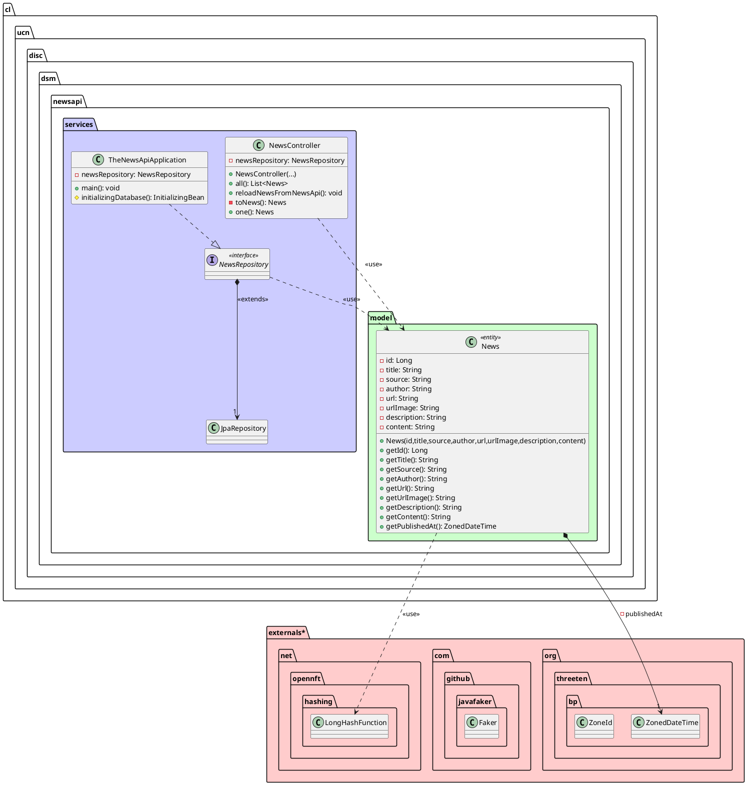

# The News API REST Project

## Class Model 

```puml
@startuml
package externals* #ffcccc {

    package org.threeten.bp{
        class ZonedDateTime{  
                
        }        
        class ZoneId {
         '''         
        }          
    }
    
    package com.github.javafaker{
        class Faker{
        
        }
    }
    
    package net.opennft.hashing{
        class LongHashFunction {
        }
               
    }
}

    package cl.ucn.disc.dsm.newsapi {
    
    package model #ccffcc {
        
        class News<<entity>> {
            -id: Long
            -title: String
            -source: String
            -author: String
            -url: String
            -urlImage: String
            -description: String
            -content: String
            +News(id,title,source,author,url,urlImage,description,content)
            +getId(): Long
            +getTitle(): String
            +getSource(): String
            +getAuthor(): String
            +getUrl(): String
            +getUrlImage(): String
            +getDescription(): String
            +getContent(): String
            +getPublishedAt(): ZonedDateTime            
        
        }               
        
        News..>LongHashFunction : <<use>>
        News *--> "1" ZonedDateTime : -publishedAt
    }
    
    package services #ccccff {
        interface NewsRepository <<interface>> {
    }
    NewsRepository ..> News : <<use>>
    NewsRepository *--> "1" JpaRepository : <<extends>>
    
    class NewsController {
        -newsRepository: NewsRepository
        +NewsController(...)
        +all(): List<News>
        +reloadNewsFromNewsApi(): void
        -toNews(): News
        +one(): News
    }
    NewsController ..> News : <<use>>

    class TheNewsApiApplication {
        -newsRepository: NewsRepository
        +main(): void
        #initializingDatabase(): InitializingBean
    }
    TheNewsApiApplication ..|> NewsRepository


}

@enduml

```

## LICENSE

[MIT] (https://choosealicense.com/license/mit/)

***
(c) 2021 Desarrollo de Soluciones Móviles